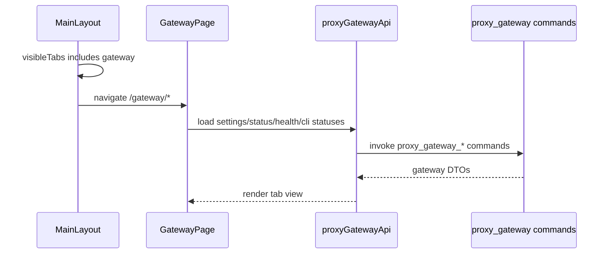

# Gateway 前端模块说明

## 一句话职责

- `gateway/` 页面负责本机代理网关的独立入口、状态统计视图、请求记录视图和网关设置视图。

## Source of Truth

- 网关设置、运行状态、CLI 接管状态都以后端 `proxy_gateway_*` Tauri 命令返回为准，前端不自行持久化。
- 顶部 `网关` 入口可见性来自全局 `visibleTabs`，只表示 UI 入口是否显示，不代表启动、停止或禁用网关服务。
- 请求记录、请求明细、统计聚合和模型健康度属于后端本地文件状态；前端只能通过后端命令读取，不直接扫描文件目录。

## 核心设计决策（Why）

- `网关` 和 `Image` 一样是 AI Toolbox 的独立工作台能力，放在顶栏右侧动作区，不放进 OpenCode / Claude / Codex / Gemini CLI 的 coding 子 Tab。
- 页面内部使用 `统计 / 请求 / 设置` 三个路由化 Tab：`设置` 承载真实可写配置，`统计` 与 `请求` 只展示后端已能返回的真实数据和空态，不伪造请求量或图表数据。
- 关闭设置页“模块显示”里的 `网关` 只隐藏顶部入口；如果用户仍打开 `/gateway/*`，布局层负责跳回可见页面，不修改网关运行态。

## 关键流程

## 易错点与历史坑（Gotchas）

- 不要把 `gateway` 加入 WSL/SSH 的 runtime 同步模块集合；它在 `visibleTabs` 里只是顶栏入口 key。
- 不要把隐藏 `gateway` 入口理解成停止服务。停止服务必须继续走网关设置里的停止按钮和后端 stop preflight。
- 请求 Tab 的列表和详情必须按“请求记录 / 请求体 / Headers / Response”分开读取；不要为了列表页一次性拉大 body。
- 当后端还没有暴露日志或统计查询命令时，页面只能显示真实空态，不能用假数据填充图表。

## 跨模块依赖

- 依赖 `@/services/proxyGatewayApi` 暴露的 Tauri 命令包装。
- 依赖 `MainLayout` 的顶部动作区、`routeConfig` 的 KeepAlive 路由和 `settingsStore.visibleTabs`。
- 设置视图当前复用 `GatewaySettingsPanel`，其数据仍通过同一组后端命令读取和保存。

## 最小验证

- 至少验证：`visibleTabs` 包含 `gateway` 时，顶栏在 `Image` 左侧显示网关入口。
- 至少验证：关闭 `gateway` 后，`/gateway/*` 会跳回可见页面，但不会调用停止网关命令。
- 至少验证：`/gateway/statistics`、`/gateway/requests`、`/gateway/settings` 三个内部 Tab 可切换且 URL 稳定。
- 至少验证：设置 Tab 中启动、停止、保存、健康检查仍走原有后端命令。
